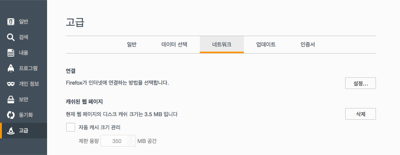
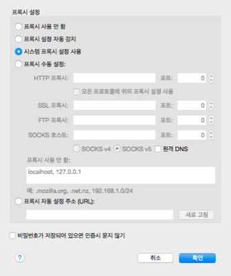

# 스퀴드(Squid)로 프록시 서버 구축하기


## 스퀴드(Squid)
### <http://www.squid-cache.org/>
 - 사전적인 의미로는 ‘오징어’
 - *오픈 소스(GPL)* 소프트웨어 **프록시 서버**이자 웹 캐시
 - 반복된 요청을 캐싱함으로 웹서버의 속도를 향상시킴
 - 네트워크 자원을 공유하려는 사람들에게 웹, DNS와 다른 네트워크 검색의 캐싱을 제공함 
 - 트래픽을 걸러줌으로써 안정성에 도움을 주는 등에 이르기까지 광범위 하게 이용됨

---

## 프록시 서버(Proxy server)
 - 사전적인 의미로는 ‘대리인'
 - 클라이언트가 자신을 통해서 다른 네트워크 서비스에 간접적으로 접속할 수 있게 해 주는 컴퓨터나 응용 프로그램
 - 서버와 클라이언트 사이에서 중계기로서 대리로 통신을 수행하는 기능을 가리켜 **'프록시'**, 그 중계 기능을 하는 것을 **'프록시 서버'** 라고 부름
 
### 프록시 서버의 장점
 - 프록시 서버에 요청된 내용들을 캐시에 저장 후, 캐시 안에 있는 정보를 이용함으써 불필요하게 외부와의 연결을 하지 않아 전송 시간을 절약 할 수 있음
 - 외부와의 트래픽을 줄이게 됨으로써 네트워크 병목 현상을 방지하는 효과도 얻을 수 있음

### 프록시 서버 사용 목적 
 - 캐시를 사용하여 리소스로의 접근을 빠르게 하기 위해
 - 원하지 않는 사이트를 차단을 위해
 - 인터넷 이용률을 기록, 검사를 위해
 - 악의적인 의도로 바이러스, 악성 루머 전파 또는, 다른 정보들을 빼낼 목적으로
 - IP 추적을 당하지 않을 목적으로
 - 밖으로 나가거나, 안으로 들어오는 콘텐츠를 검사하기 위해
 - 우회하기 위해

---
## 스퀴드(Squid) 설치

 - #### homebrew 를 이용한 스퀴드 설치
> brew install squid 

 - #### yum 을 이용한 스퀴드 설치
> yum install squid

---

## 스퀴드(Squid) 구성

1. bin : squid 실행과 관련된 스크립트 파일이 있는 디렉토리
2. etc : squid 관련 환경 설정 파일인 **squid.conf** 가 있는 디렉토리
3. libexec : 서버운영과 관련된 스크립트 파일이 있는 디렉토리
4. lib : 프로그램 개발에 필요한 라이브러리 정보들이 있는 디렉토리
5. man : **man** 명령 관련 정보들이 있는 디렉토리
6. sbin : squid 서버를 실행하고 관리하는 **squid** 라는 명령이 위치하는 디렉토리
7. share : squid 를 사용하면서 발생하는 에러 메시지에 대한 정보들이 있는 디렉토리
8. var : 로그 파일에 대한 정보들이 있는 디렉토리

---

## 스퀴드(Squid) 설정

 - squid.conf 파일을 수정하면 됨

#### 포트 설정
```
http_port 3128
 - 스퀴드 서버 포트를 설정한다.
 - default 값은 3128 이다.
```

#### 캐시 설정 
```
cache_mem 8 MB
 - 스퀴드 서버에서 사용하는 캐시 사이즈를 설정한다.
```
```
maximum_object_size 4096 KB
 - 캐시 서버에 저장될 수 있는 객체 즉, 파일의 크기를 제한하는 옵션이다.
```
```
cache_dir ufs /usr/local/squid/cache 100 16 256
 - 캐시가 저장될 경로를 지정해주는 항목으로 크기와 생성될 하위 1차 및 2차 디렉토리의 수를 지정한다. 
 - 현재 설정은 /usr/local/squid/cache 디렉토리에 캐시데이터들이 최대 100MB 까지 저장될 수 있고, 캐시가 저장될 1차 디렉토리는 16 개로 설정하고 그 밑에 2차 디렉토리 수를 256 개로 설정한다.
```
```
cache_mgr admin
 - 캐시서버의 관리자 계정을 지정한다.
```
```
cache_effective_user squid
cache_effective_group squid
 - 스퀴드 서버를 작동시킬 유저와 그룹명을 지정해준다.
 - 캐쉬 디렉토리의 소유자와 소유자그룹을 나타낸다.
 - 현재 설정은 cache 가 squid 란 uid/gid 로 작동하도록 설정한다.
```


#### 로그 설정
```
cache_access_log /usr/local/squid/logs/access.log
 - 접근로그를 기록하는 파일을 설정한다.
```
```
cache_log /usr/local/squid/logs/cache.log
 - 캐쉬설정에 관한 로그를 기록하는 파일을 설정한다.
```
```
cache_store_log /usr/local/squid/logs/store.log
 - 저장되는 로그(이미지, 아이콘 등)를 기록하는 파일을 설정한다.
```
```
debug_options ALL,1
 - 스퀴드가 동작할 때 오류체크 기능을 사용하여 로그파일에 기록할 수 있게 하는 옵션이다.
 - 현재 설정은 모든 항목에 대해 기본적인 값만 로그에 남도록 설정한 것이다.
```
```
buffered_logs on
 - 로그 기록시 사용되는 시스템 자원을 절약함으로써 약간의 속도 향상을 기대할 수 있는 옵션이다.
```

#### 특정사이트 차단
```
acl blocksitelist dstdomain "blockwebsites.lst"
http_access deny blocksitelist
```
```
cat blockwebsites.lst
www.naver.com
www.jejunu.ac.kr
```

#### 접근 설정
```
 visible_hostname 호스트이름
  - squid 서버에 특정 호스트 이름을 부여할수 있다.
```
```
acl all src 0.0.0.0/0.0.0.0
 - ACL은 Access Control의 약자로 프록시 서버에 접근할 수 있는 범위를 설정하는 옵션으로 http_access와 함께 사용해야 한다. 
 - all의 범위는 src옵션으로 지정한 범위는 속하는 네트워크를 지정한다. 
 - 현재처럼 0.0.0.0/0.0.0.0으로 설정하면 모든 네트워크에 대해서 프록시서버에 접근할 수 있다. 
 - 자신의 프록시서버에 제한없이 모든 네트워크들이 접근할 수 있도록 설정한 후 httpd_access로 프록시 서버사용권한을 부여할 수 있다.
```
```
acl all src 0.0.0.0/0.0.0.0
http_access allow all
 - 모든 네트워크들이 자신의 프록시서버를 이용할 수 있게 지정한 것이다. 
 - 이 경우에는 네트워크 트래픽을 초래할 수 있다. 
```
```
http_access deny all
 - 클라이언트가 프록시 서버에 접속을 허용할 것인지 거부할 것인지 결정해주는 옵션으로 acl과 함께 사용된다. 
 - http_access다음에 all 또는 deny를 지정하고 acl리스트 중 하나를 지정해 사용한다.
```
```
acl user src 192.168.3.69
acl all src 0.0.0.0/0.0.0.0
http_access allow ser
http_access deny all
 - 192.168.3.69 네트워크주소를 user 만 프록시서버 접속을 허용하고, 다른 네트워크에 대해서는 접속을 거부한다.
```
```
acl members src 192.168.3.0/255.255.255.0
acl all src 0.0.0.0/0.0.0.0
http_access allow members
http_access deny all
 - 192.168.3.0 네트워크주소를 members 범위로 규정하여 http_access 에서 프록시서버 접속을 허용하고, 다른 네트워크에 대해서는 접속을 거부한다.
```

---

## 스퀴드(Squid) 서버 시작/종료

 1. squid.conf 에서 환경설정
 
	*vi /squid/etc/squid.conf*
 
 2. 캐시 영역으로 사용할 디렉토리를 /squid/var 하나위에 생성
 
 	*mkdir /squid/var/cache*
 
 3. 모든 사람들이 접근할 수 있도록 허가권을 설정
 
 	*chmod 777 /squid/var/cache*
 
 4. 캐시용 디렉토리를 초기화
 
 	***/squid/sbin/squid -z***
 
 5. 데몬을 실행
 
 	 - ***/squid/sbin/squid***
 	 
 	 - ***service squid start***
 	 
 	
 6. 데몬을 종료
 
 	 - ***squid -k shutdown***
 	 
 	 - ***service squid stop***
 	 
 	
 7. 데몬을 재살행
 
    - ***squid restart***
    
    - ***service squid restart***
    
    
 8. 실행중인 데몬 확인
 
 	- ***service squid status***
 	
 	- ***ps -ef | grep squid***

---

## 프록시 서버 사용하기

- 웹브라우저에 맞춰서 환경설정에서 해주면 됨

---

### 크롬(Chrome)

###### 1. 크롬 맞춤설정 및 제어에서 '설정' 탭을 클릭 

###### 2. '고급 설정 표시' 클릭  

###### 3. '프록시 설정 변경' 클릭 

##### 4. 프록시 서버 IP 와 Port 를 설정 후 승인


---

### 파이어폭스(Firefox)

###### 1. 파이어폭스 메뉴 열기에서 '환경' 탭을 클릭 

###### 2. '고급 설정'에서 '네트워크' 탭에서 '설정' 클릭  

###### 3. '프록시 수동 설정' 에서 프록시 서버 IP 와 Port 를 설정 후 확인


___

## 주의사항
 - ***접근 설정 순서***
 	1. 특정사이트 차단
 	2. 접근 설정
 	3. 나머지 사용자 차단(*'http_access deny all'*)
 - ***모든 사용자*** 가 캐시(cache) 디렉토리 접근을 위해 접근권한 (*chmod 777*)을 줘야함
 - 그래도, 캐시(cache) 디렉토리 접근을 못할 시 ***소유자 와 소유자 그룹*** 을 확인
 - 특정사이트 차단 파일을 통해 설정 시, 파일 안에 아무내용이 없을 경우 경고를 출력함
 - 스퀴드를 실행하는 중에 에러가 발생할 경우 ***'/var/log/messages'*** 를 확인

---

## 참고자료

 - 스퀴드 위키백과
 
	<https://ko.wikipedia.org/wiki/스퀴드_(소프트웨어)>

 - 프록시 서버 위키백과
 
	<https://ko.wikipedia.org/wiki/프록시_서버>

 - 관련 블로그
 
	 - <http://blog.naver.com/jeniday/10037704311>
	 - <http://snsdjess.blogspot.kr/2009/08/squid-1.html>
	 - <http://attiadmin.guyweb.co.kr/server/squid25.html>
	 - <http://gang7304.tistory.com/entry/squid-프록시-서버>
	 - <http://www.yongbok.net/blog/squid-프록시-서버-설치/>
	 - <http://magazine.redhat.com/2007/04/11/squid-in-5-minutes/>
	 - <http://tecadmin.net/install-and-configure-squid-proxy-server-on-centosrhel-linux/>
	
 - 프록시 서버 모음
 
 	<http://proxy.ti8.kr/>

---
